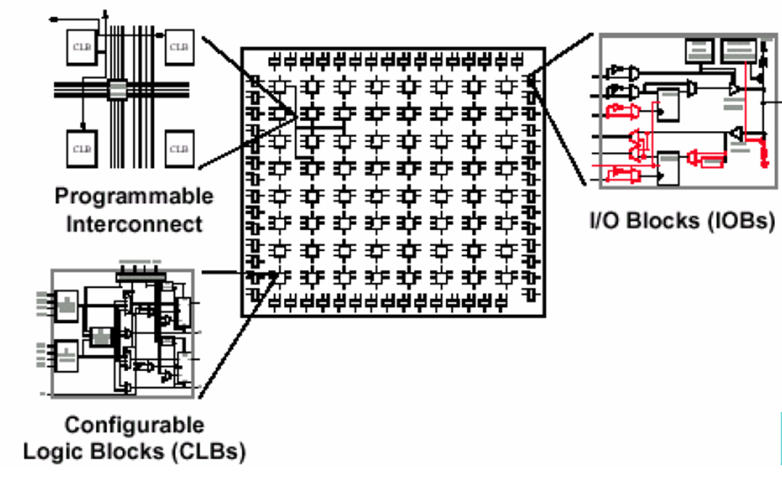
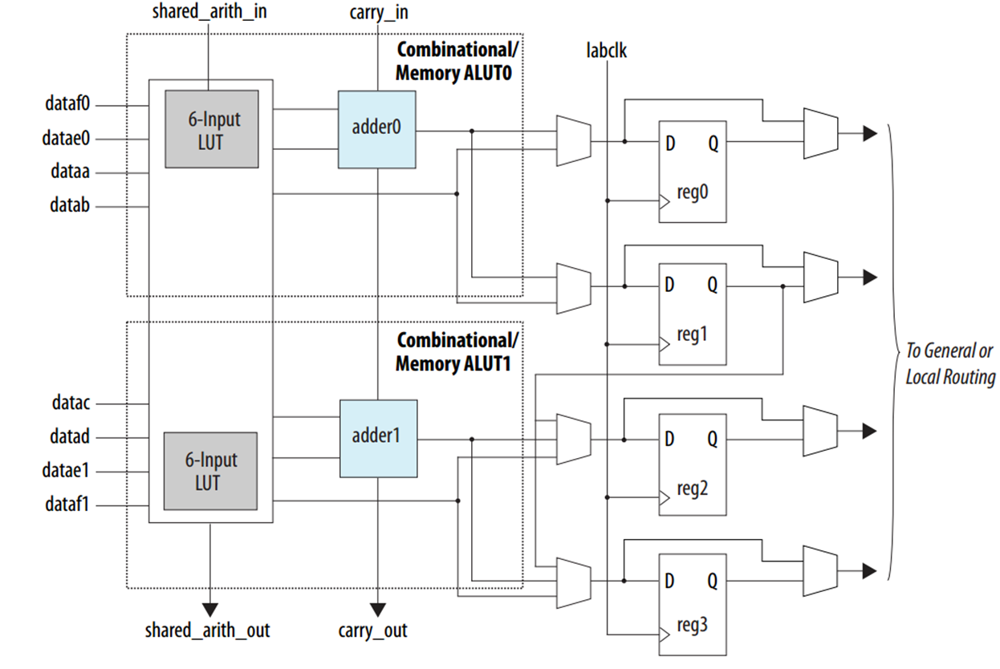
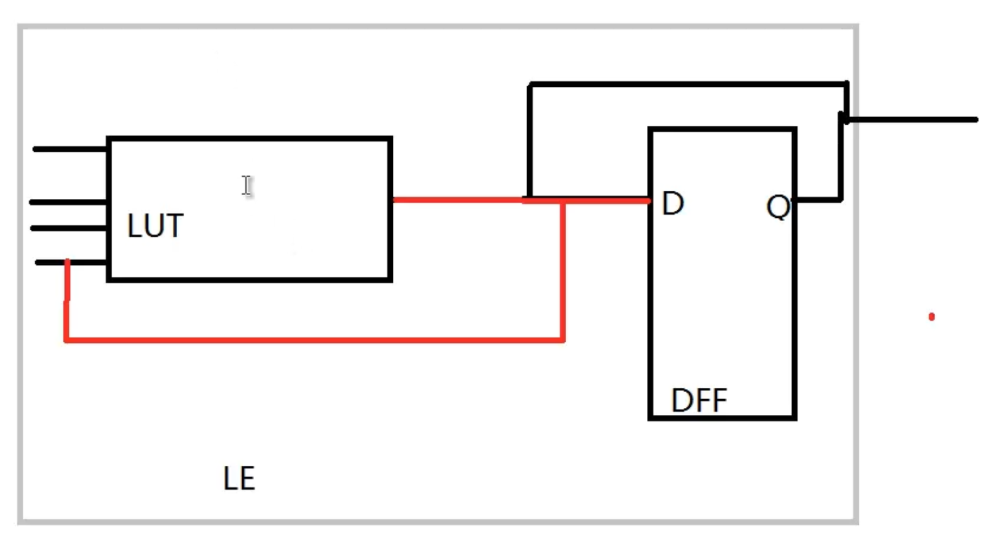
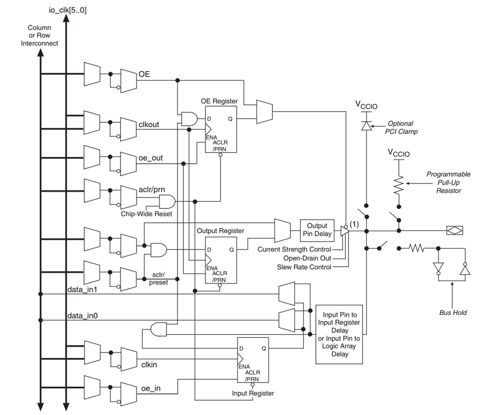
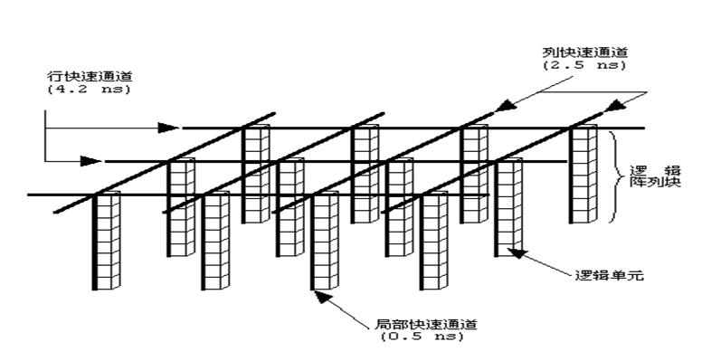
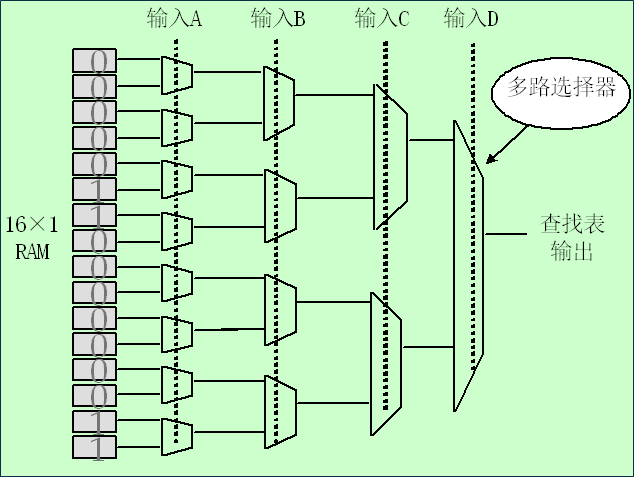
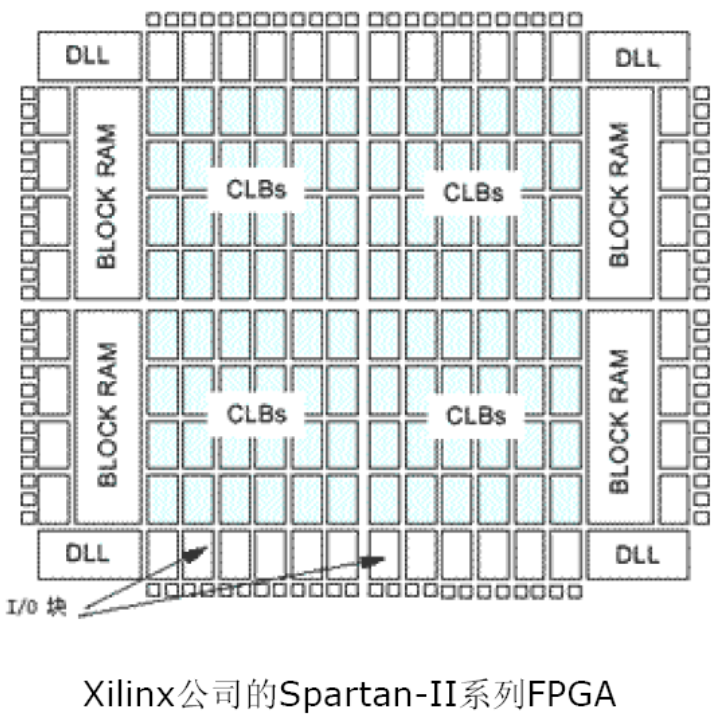
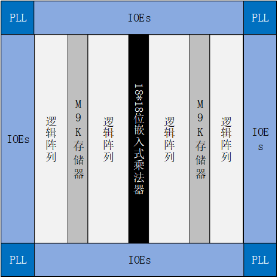

# FPGA基本原理

## FPGA是什么？

Field Programmable Gate Array：现场可编程逻辑门阵列

+ 现场可编程：通过JTAG、AS、PS等方式，可以现场对器件进行编程，以实现各种不同的定制功能。
+ 门：只能实现基本逻辑关系的电路称为门。最基本的逻辑关系是与、或、非，最基本的逻辑门是与门、或门和非门
+ 门阵列：将实现基本逻辑关系的电路按照阵列的形式排布，就形成了门阵列。

## FPGA由哪几部分构成？

三部分：可编程逻辑功能块，片内互连线（programmable interconnect），输入输出块；

### 1.可编程逻辑功能块

+ 可编程逻辑功能块是实现用户功能的基本单元，多个逻辑功能块通常规则的排成一个阵列结构，分布于整个芯片。
+ 一个可编程逻辑功能块基本组成包括：查找表、D触发器、进位链等。

以cycloneV可编程逻辑功能块为例，从左到右依次为查找表、进位链、D触发器。

数据流经逻辑功能块的路径：

1. 只用LUT：实现组合逻辑；
2. 只用D触发器：实现单纯打拍；
3. LUT+DFF：实现时序逻辑；

### 2.可编程输入输出块

可编程输入输出块完成芯片内部逻辑与外部管脚之间的接口，围绕在逻辑单元阵列四周，可编程输入输出块的功能和性能从一定程度上也决定了该器件的市场定位。

一个可编程输入输出基本单元包括：输入寄存器、输出寄存器、输出 使能寄存器、输入延迟链、输出延迟链、上拉电阻等。

### 3.可编程内部互联资源

可编程内部互联资源包括各种长度的连线线段和一些可编程连接开关，它们将各个可编程逻辑块或输入\输出块连接起来，构成特定功能的电路。用户可以通过编程决定每个单元的功能以及它们的互连关系，从而实现所需的功能逻辑。

Altera FPGA采用行、列、局部快速通道，eg：

+ 行快速通道：4.2ns
+ 列快速通道：2.5ns
+ 局部快速通道：0.5ns

## FPGA可编原理

+ 与PLD的主要区别：编程原理
    + PLD：修改具有固定内联电路的逻辑功能来进行编程；
    + FPGA：修改一或多根内连线的布局，更适合实现多级的逻辑关系；
+ 按编程方式和逻辑功能的类型：
    + SRAM-查找表类型：Intel，Xilinx
    + 反熔丝的多路开关类型FPGA器件：Actel
    + 基于Flash的FPGA：Lattice

### 查找表内部结构

查找表由多路选择器构成，通过设置输入A\B\C\D来配置查找表，以获得不同的A\B\C\D来对应不同的输出。

+ 一个N输入查找表可以实现N个输入变量的任何逻辑功能，如N输入“与”、N输入“异或”等。
+ 输入多于N个的函数，方程必须分开用几个查找表实现。

### 可编程IO功能

+ IO模块配有缓冲器和寄存器，可实现电平匹配、提高驱动能力、延时等功能；
+ 可实现单端IO和差分IO，差分IO有LVDS和LVPECL两种协议，它们的电平和外部终端电路不一样；
+ IO电平驱动放过冲解决方案：分压电阻和齐纳二极管；
+ 能兼容TTL和CMOS多种接口和电压标准；
+ 可配置为输入、输出、双向、三态、双速率等形式；
+ 能提供适当的驱动电流；
+ 降低功耗，防止过冲和减小电源噪声；
+ 支持多种接口电压（降低功耗）；

除了上述构成FPGA基本结构的三种资源以外，随着工业的进步和应用系统需求的发展，FPGA中一般还包含以下可选资源：

+ 存储器资源：块RAM、分布式RAM；
+ 数字时钟管理单元：分频\倍频、数字延迟、时钟锁定；
+ 算数运算单元：高速硬件乘法器，乘加器；
+ 高速串行IO接口；
+ 特殊功能模块：PCIE、DDR等硬IP核；
+ 微处理器：Cortex-M3、Cortex-A9/A53、PowerPC；

### 典型FPGA结构

+ Xilinx SpartanII

+ intel

