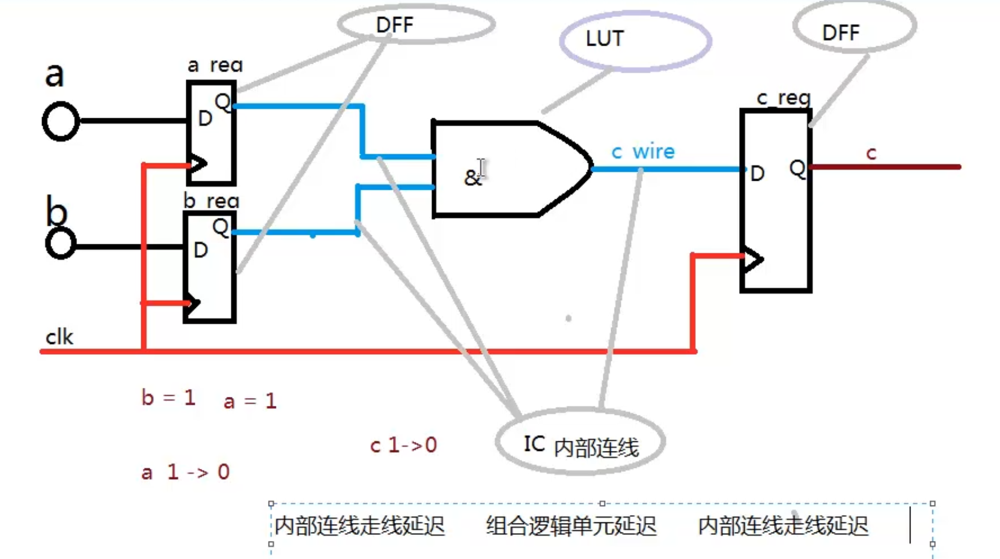
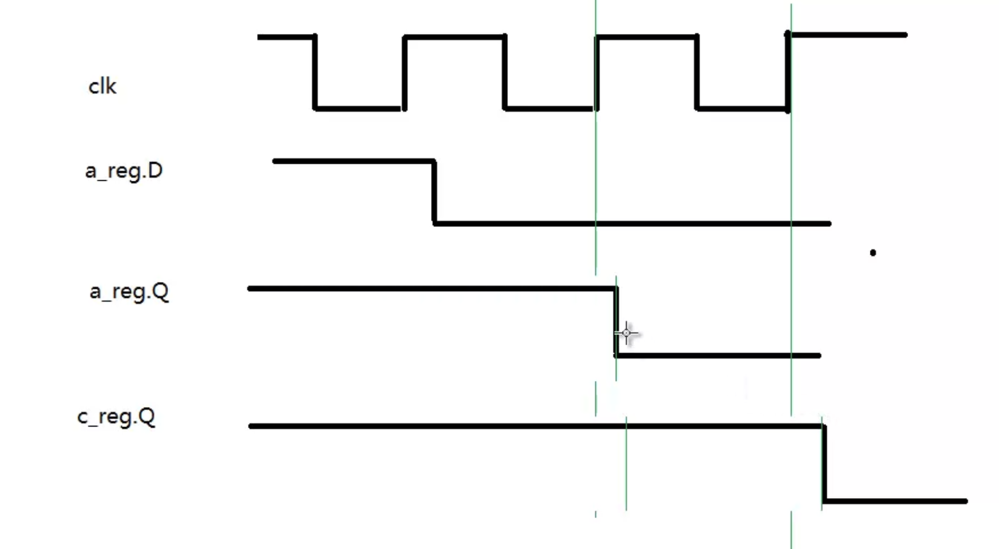
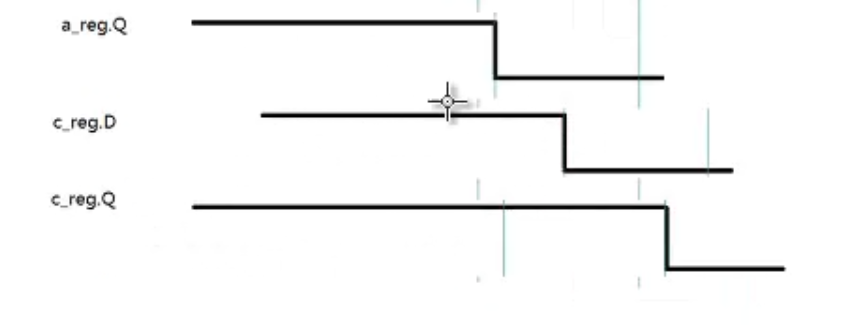
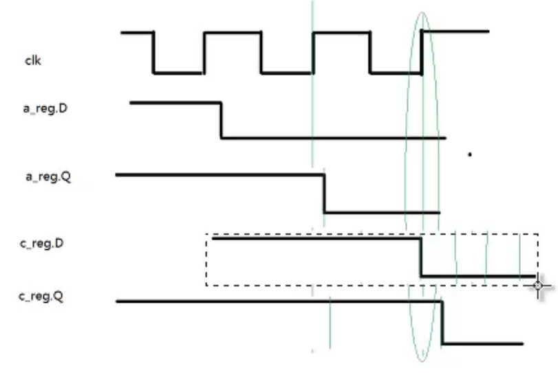

# FPGA内数据传输模型

## 什么是时序分析？

时序分析的目的就是通过FPGA设计中各个寄存器之间的数据和时钟传输路径，来分析**数据延迟**和**时钟延迟**之间的关系。一个设计合格的系统，必然能够保证整个系统中所有的寄存器都能够正确的寄存数据。

> 数据和时钟传输路径是由EDA软件，通过针对特定器件布局布线得到的。

## 什么是时序约束？

1. 告知EDA软件，该设计需要达到怎样的时序指标，然后EDA软件会根据时序约束的各个参数，尽力优化布局布线，以达到约束的指标。
2. 协助EDA软件进行分析设计的时序路径，以产生相应的时序报告。

## 时序分析的基本模型是什么？

以下代码为例：

```verilog
module reg_test (
    clk,
	a,
    b,
    c
);
    input clk;
    input  a;
    input  b;
    output c;

    reg a_reg;
    reg b_reg;
    reg c_reg;
    
    wire c_wire;
    
    always@(posedge clk) begin
       a_reg <= a;
       b_reg <= b;
    end
    
    assign c_wire = a_reg & b_reg;
    
    always@(posedge clk)
        c <= c_wire;
    
endmodule
```

 RTL实现示意图：



## 分析时序路径的包括哪些部分？

Tco 时序示意图：



+ Tco：时钟上升沿到达D触发器 到 数据输出到Q端的延迟（信号流经D触发器所耗费的时间：理想情况下，D触发器在时钟上升沿时D触发器Q端就应该输出D端电平，实际上在上升沿滞后一段时间输出）。

 走线延迟示意图：



Tdata：信号在FPGA内部流经内部连接线与LUT，也会造成时序上的延迟；即留出a_reg.Q到达c_reg.D之间有段时间的延迟。

亚稳态产生的原因：在D触发器上升沿时D段信号发生突变，造成信号不稳定。



+ Tsu：建立时间，目的寄存器自身的特性决定，在时钟信号上升沿到达其时钟接口时，其数据输入端(D)的数据必须提前Nns稳定下来，否则就无法确保数据正确存储。（D触发器D端口的数据必须比时钟上升沿提前Nns到达D触发器端口）。

 即时序稳定的前提是在一个时钟周期内，寄存器的延时（Tco）+ 内部连线与LUT的延时 + Tsu建立时间 ≤ 一个周期的时间。

时序约束就是告诉EDA两个端口之间的延时时间符合所需的特定的频率周期。