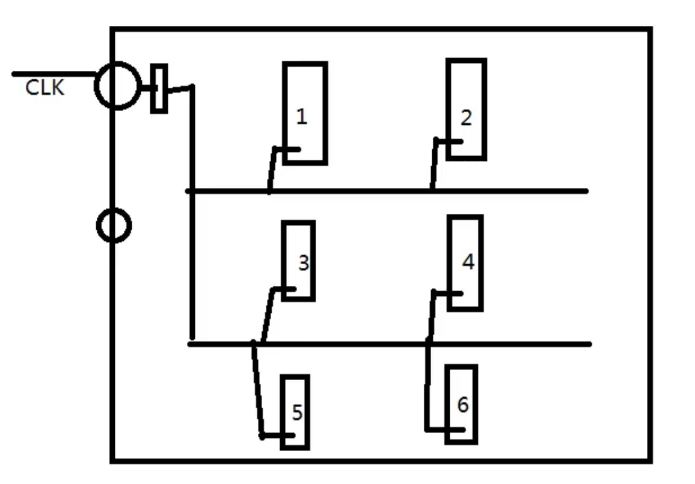

# 时序传输模型分析

## FPGA内部时钟树

clk到达每个寄存器的时间不一致。

内部时钟树内部示意图如下所示：

在实际FPGA芯片内部，时钟到达每个寄存器的时钟偏差很小，但仍然存在；比如clk到达REG1花费时间0.2ns，到达REG6花费时间0.4ns。

 ## 考虑时钟偏斜

时钟偏斜（Skew）：时钟从源端口出发，到达目的寄存器和源寄存器之间的时间差值。

+ RTL示意图如下所示;

+ 时序图如下所示：

定义Tskew=Tclk2-Tclk1；

1. clk2迟于clk1；Tskew>0;

 2.clk2早于clk1；Tskew<0；

+ 时序分析基本公式：

目的寄存器能够正确接收元数据发射过来的数据：

Tclk1(到达REG1时钟延迟) + Tco + Tdata  <= Tclk(时钟周期) + Tclk2(到达REG2时钟延迟) -Tsu

> 不考虑时钟偏斜即Tclk1 = Tclk2；
>
> Tclk(时钟周期) + Tclk2(到达REG2时钟延迟) -Tsu：数据需求时间
>
> Tclk1(到达REG1时钟延迟) + Tco + Tdata：数据到达时间（TimeQuest）

移项： Tclk + Tclk2 -Tsu - Tclk1 - Tco - Tdata >= 0

结合： Tclk + （Tclk2 - Tclk1）- Tsu - Tco - Tdata >= 0

令Tclk2 - Tclk1 = Tskew： Tclk + Tskew- Tsu - Tco - Tdata >= 0

设Tslack = Tclk + Tskew- Tsu - Tco - Tdata

可得最终条件为：Tslack（建立时间余量） >= 0

