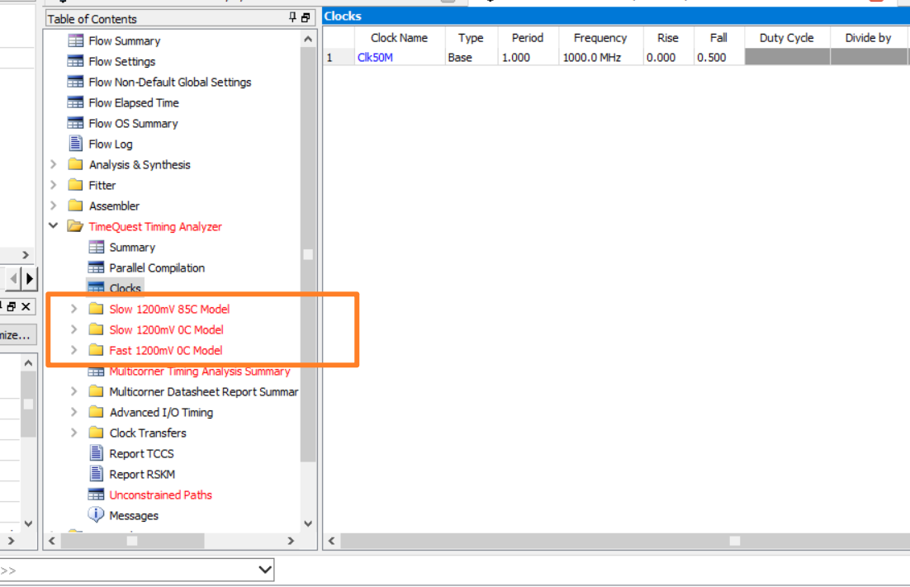

# FPGA时序分析工具使用

  将以下代码为例：

```verilog
module counter(
			Clk50M,
			Rst_n,
			led
		);

	input Clk50M;	
	input Rst_n;	
	
	output reg led;	
	
	reg [24:0]cnt;	


	always@(posedge Clk50M or negedge Rst_n)
	if(Rst_n == 1'b0)
		cnt <= 25'd0;
	else if(cnt == 25'd24_999_999)
		cnt <= 25'd0;
	else
		cnt <= cnt + 1'b1;


	always@(posedge Clk50M or negedge Rst_n)
	if(Rst_n == 1'b0)
		led <= 1'b1;
	else if(cnt == 25'd24_999_999)
		led <= ~led;
	else
		led <= led;

endmodule
```

+ 这段代码能够运行在多高的时钟频率？

> 这个代码**所描述的逻辑电路**能最高运行在多少频率的时钟？

> 这个代码所描述的**CycloneIV E（65nm）这个器件**上能最高运行在多少频率的时钟？

> 这个代码描述的逻辑电路在CycloneIVE的**EP4CE10F17C8**这个器件上最高能运行在多少频率的时钟？

需要时序分析软件高速我们时钟频率—TimeQuest，通过TimeQuest这个软件对**EP4CE10F17C8**进行分析，并给出报告。

时序分析一定时基于特定器件（该器件需要具体到一个特定型号的特定速度等级 ）。

时序分析一定是基于某个逻辑设计在该特定器件上经过布局布线之后的**网表**（该网表包含了设计中每一个逻辑具体在该器件的什么资源上实现，而且还包括该资源在器件内的具体位置；该网表还包括信号从每一个节点传输到下一个节点的具体延迟时间 ）。

时序分析不是在对代码进行分析，而是在对真实的门极传输路径进行分析。

使用Quartus进行全编译：


右侧报告Clocks：1000MHz，即1GHz。

这是软件报告汇中的时钟信号的约束频率，如果用户没有对时钟信号加约束，软件就会对分析出的时钟信号加入约束，这个约束会按照最大的可能来约束，也就是最大设置时钟频率为1000MHz。



框中表示的是时序分析出的三个模型，分别为;

1. Slow 1200mV 85C Model：芯片内核**供电电压**1200mV，**工作温度**85摄氏度情况下**慢速**传输模型。
2. Slow 1200mV 0C Model：芯片内核**供电电压**1200mV，**工作温度**0摄氏度情况下**慢速**传输模型。
3. Fast 1200mV 0C Model：芯片内核**供电电压**1200mV，**工作温度**0摄氏度情况下**快速**传输模型。


参考Slow 1200mV 85C Model，Fmax=250.13MHz，满足50M需求。

软件之所以标红，是由于目前没有添加时序约束，虽然变量名称带有50M，但EDA软件不会了解；软件默认按最高频率来约束，即1000MHz，但实际最高250.13MHz，认为没有满足需求，所以报错。

分析设计的时序路径，分析的是寄存器到寄存器，一般不跨寄存器分析。

软件计算最高时钟频率的时候，是根据最坏路径的建立时间余量来计算的。

+ 如何告知时序分析软件时钟频率是多少？

约束：时钟约束。

> 操作步骤：
>
> 1. 打开TTA软件；
> 2. 创建时序网表；
> 3. 读取SDC文件；
> 4. 看报告/加入约束；
> 5. 写SDC文件。

约束的作用：

1. 指导EDA软件对设计的布局布线进行合理优化以尽量满足约束需求；
2. 给时序分析工具提供一个分析时序的参考；